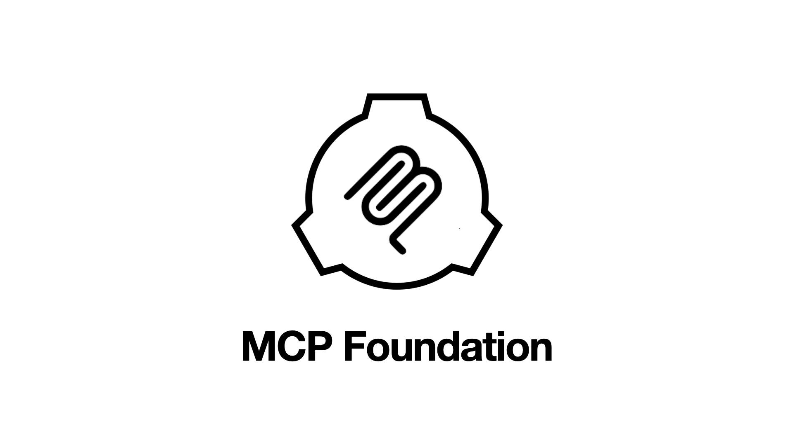

# MCP Foundation

> Model Context Protocol Manager



## 1. Web

```
npx -y -p mcpfoundation@latest web
```

## 2. CLI

```
npx mcpfoundation add <name> (<args...>)
npx mcpfoundation rm <name> (<args...>)
npx mcpfoundation ls
```

1. Easily add or remove MCP servers with one line.
2. View published servers.

# Quickstart

## 1. One-Click Install

Install Pinokio and run MCP Foundation in Pinokio. Everything is taken care of.

## 2. Manual Install

1. Follow the instructions in the [Install Section](#install) to install the prerequisites.
2. Run `npx mcpfoundation add cocktailpeanut/mcp/sqlite`


# Install

## 1. One-Click Install

Install on Pinokio.

## 2. Manual Install

First make sure the following prerequisites are installed on your machine.

1. UV: https://docs.astral.sh/uv/
2. Git: https://git-scm.com/
3. Sqlite3: https://www.servermania.com/kb/articles/install-sqlite
4. Node.js: https://nodejs.org/en


# Web Usage

The easiest way to use is through the web ui.

```
npx -p mcpfoundation web
```


# CLI Usage

## 1. add

Basic

```
npx mcpfoundation add <name>
```

Modules that require environment variables:

```
npx mcpfoundation add <github id>/<name> --GITHUB_PERSONAL_ACCESS_TOKEN <token> ...
```

## 2. rm

```
npx mcpfoundation rm <name>
```

## 3. update

```
npx mcpfoundation update
```


## 4. ls

display all installed mcp servers

```
npx mcpfoundation ls
```


# Customize

## Web UI Customization

Environment variables

1. `PORT`: (for web ui only) use custom port for the web ui
2. `MCP_DEFAULT_REPO`: (for web ui only) the default mcp default repository

Additionally, any environment variables on your system will be available

## MCP Client Customization

By default, the MCP config file is stored under the Claude app

- Windows: `%AppData%/Claude/claude_desktop_config.json`
- Mac: `$HOME/Library/Application Support/Claude/claude_desktop_config.json`

But you can change these locations by setting:

- `MCP_CONFIG_PATH`: the absolute path where the config file needs to be stored.

## MCP Server Path Customization

By default, all the MCP Foundation code is downloaded under `~/mcpfoundation`.

You can change this behavior by setting:

- `MCP_SERVER_PATH`: the absolute path where each MCP foundation repository will be downloaded.

## Environment Value Customization

By default, MCP clients use the system wide environment variables. But sometimes you may want to make it use custom environment variables. In these cases you can use:

- `MCP_ENV`: a comma separated value to specify the environment variable names to inherit

- **Example:** If you set `MCP_OVERRIDE_ENV=PATH`, the `PATH` value of the current environment will be used by the MCP client.
- **When is this useful?:**
    - Sometimes you want to run these commands inside a specific context such as **conda environment** or **venv**. If you do not override the MCP environment, it will just use the default PATH to run the programs globally.
